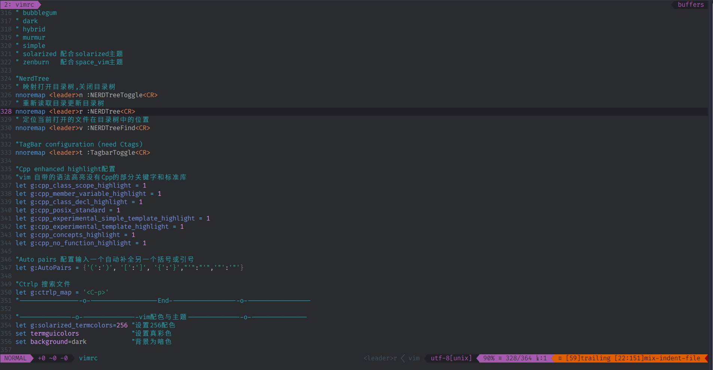

# Myvim

我的vim配置

## 插件

1. 使用Vimplug插件管理器安装的插件有:
	Startify
	Coc.nvim
	vim-go
	ctrlp
	tagbar
	nerdtree
	auto-pairs
	vim-commentary
	indeneline
	vim-gitgutter
	vim-interestingwords
	markdown-preview
	cpp_enhance highlit
	Airline
	Neoformat
	BufOnly	
	多个主题插件

2. 插件配置

插件配置简洁，含有注释

## 截图

